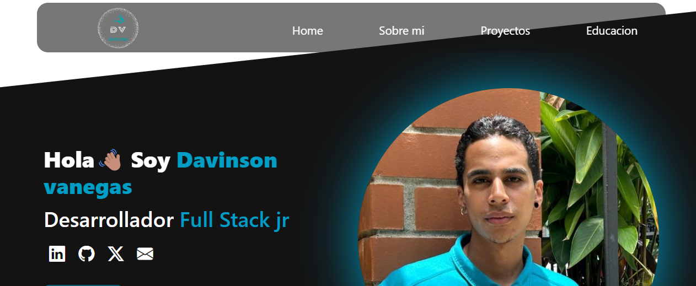
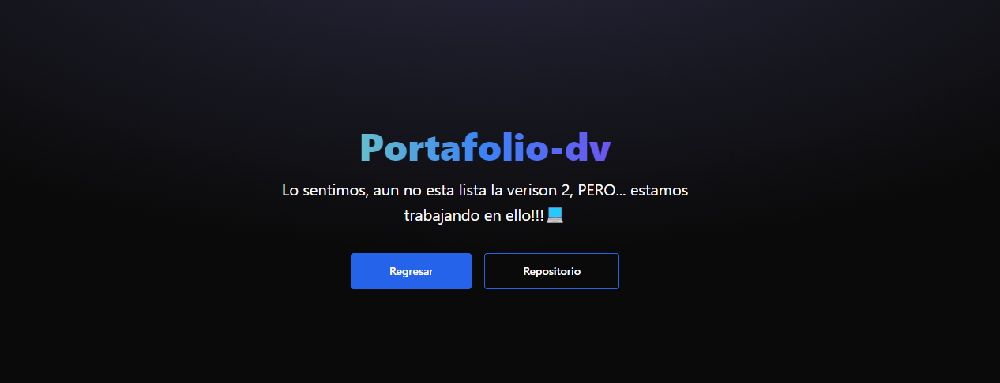

# PORTAFOLIO-DV

> Portafolio personal💻, desarrollado para dar a conocer mi trabajo como desarrollador de software, y brindar informacion relevante sobre mi vida laboral y educacional 

## 🔗 Redes de interes

## Portafolio-dv v1

## 🚀 Sobre mi
Holaa, soy Davinson Vanegas, Desarrollador de Software | Freelance Full-Stack, soy una persona dedicada en si mismo y en el bienestar de los demas, me gusta mucho colaborar y aportar de manera activa en cualquier proyecto o empresa que requiera de mis servicios. mi stack se basa mas que todo en entorno JS, utilizando las siguientes tegnologias.

## Front-end
- HTML | CSS3
- VANILLA JS
- SASS
- BABEL

## Back-end
- NODE.JS
- EXPRESS
- TYPESCRIPT
- MYSQL
- PHP
- JQUERY
- BABEL

## Framework
- BOOTSTRAP | TAILWINDCSS
- ASTRO

## Portafolio-dv v2

